## 목차

1. [알고리즘](#1-알고리즘)
2. [배열](#2-배열)
3. [버블 정렬](#3-버블-정렬)
4. [카운팅 정렬](#4-카운팅-정렬)
5. [완전검색](#5-완전검색)
6. [그리디](#6-그리디)
7. [배열: 2차원 배열](#7-배열-2차원-배열)
8. [부분집합 생성(비트연산자)](#8-부분집합-생성)
9. [바이너리 서치](#9-이분탐색)
10. [셀렉션 알고리즘](#10-셀렉션-알고리즘)
11. [선택정렬](#11-선택정렬)

## 1. [알고리즘](#목차)
### 알고리즘
- (명)알고리즘: 유한한 단계를 통해 **문제를 해결하기 위한** 절차나 방법이다. 주로 컴퓨터용어로 쓰이며, 컴퓨터가 어떤 일을 수행하기 위한 단계적 방법을 말한다.<br><br>
- 알고리즘을 표현하는 두가지 방법
    1. 슈도코드<br>
    <figure>
    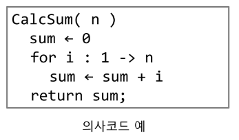
    </figure>
    2. 순서도<br>
    <figure>
    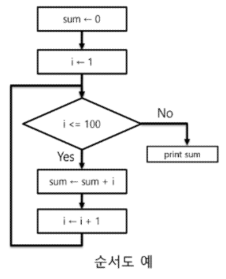
    </figure>
- 알고리즘의 성능 측정
    1. 정확성 : 얼마나 정확하게 동작하는가
    2. 작업량 : 얼마나 적은 연산으로 원하는 결과를 얻어내는가
    3. 메모리 사용량 : 얼마나 적은 메모리를 사용하는가
    4. 단순성 : 얼마나 단순한가
    5. 최적성 : 더 이상 개선할 여지없이 최적화 되었는가<br><br>
    - APS의 목적 중 하나는 보다 좋은 알고리즘을 이해하고 활용하기 위해서 이다.
    - 주어진 문제를 해결하기 위해 사용할 수 있는 알고리즘은 여러가지가 있기 때문에 알고리즘의 성능 분석이 중요하다.<br><br>
    - 일반적으로 알고리즘의 작업량을 표시할 때 시간복잡도를 이용한다.
        - 실행되는 명령문 수를 계산하여 실제 걸리는 시간을 측정하는 방법
    - 빅오(O) 표기법
        - 시간복잡도 함수 중에서 가장 큰 영향력을 주는 n에 대한 항만 표시
        - 계수를 생략한다.<br>
        <figure>
        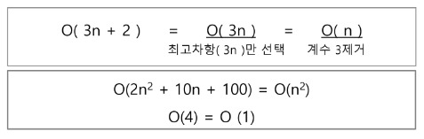
        </figure>
- 다양한 시간복잡도의 비교
    - 요소수 증가에 따른 각 시간복잡도의 연산 수 변화<br>
    <figure>
    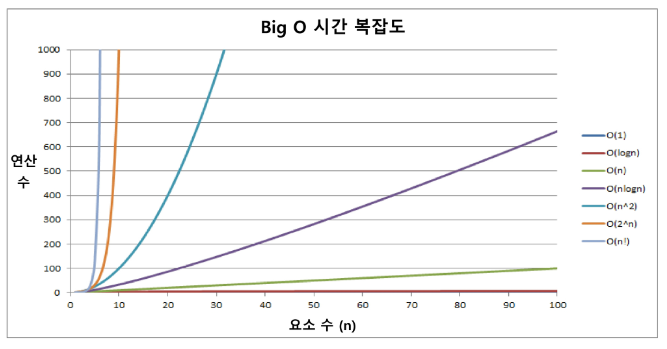
    </figure>
    - 시간복잡도별 실제 실행 시간<br>
    <figure>
    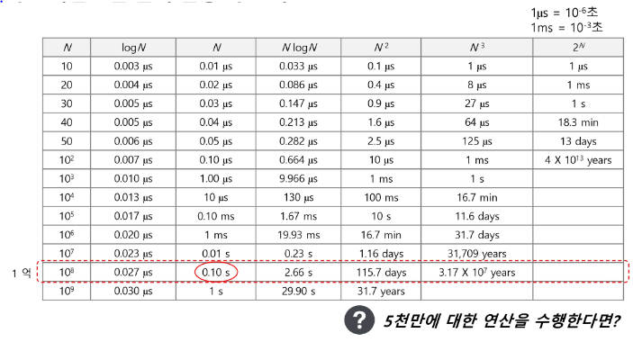
    </figure>
## 2. [배열](#목차)
- 배열
    - 배열이란 무엇인가?
        - 일정한 자료형의 변수들을 하나의 이름으로 열거하여 사용하는 자료구조 (인덱스로 접근 가능한 것들)<br><br>
    - 배열의 필요성
        - 프로그램 내에서 여러 개의 변수가 필요할 때, 일일이 다른 변수명을 이용하여 자료에 접근하는 것이 비효율적이다.
        - 이때, 배열을 사용하면 하나의 선언을 통해 **둘 이상의 변수를 선언**할 수 있다.
        - 단순히 다수의 변수 선언을 의미하는 것이 아니라, **다수의 변수로는 하기 힘든 작업**을 배열을 활용해 쉽게 할 수 있다.<br><br>
- 1차원 배열
    - 1차원 배열의 선언
        - 별도의 선언 방법이 없으면 변수에 처음 값을 할당할 때 생성된다.
        - 이름: 프로그램에서 사용할 배열의 이름<br><br>
        - 1차원 배열 선언의 예<br>
            ```python
            Arr = list()
            Arr = []
            Arr = [1, 2, 3]
            Arr = [0]*10
            ```
        - 1차원 배열의 접근<br>
            ```python
            Arr[idx] = value  # Arr의 idx번째 요소에 value를 할당한다.
            ```
            <br>
        - 배열 활용 예제: Gravity<br>
        <figure>
        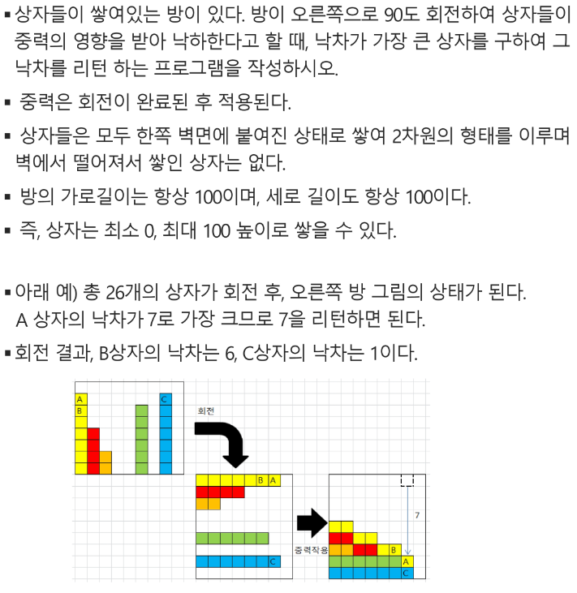
        </figure>
### 정렬 기초
- 정렬
   - 2개 이상의 자료를 특정 기준에 의해 오름차순, 내림차순으로 재배열 하는 것
   - 키 : 자료를 정렬하는 기준이 되는 값
- 정렬의 종류
    - 대표적인 정렬 방식의 종류
        1. 버블 정렬
        2. 카운팅 정렬
        3. 선택 정렬
        4. 퀵 정렬
        5. 삽입 정렬
        6. 병합 정렬<br><br>
- 정렬 알고리즘의 비교<br>
    <figure>
    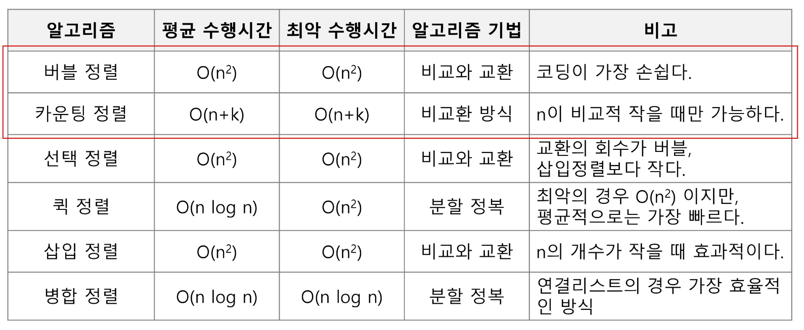
    </figure>
### 3. 버블 정렬
- 버블정렬
    - 인접한 두 개의 원소를 비교하며 자리를 계속 교환하는 방식
    - 정렬 과정
        1. 첫 번째 원소부터 인접한 원소끼리 계속 자리를 교환하면서 맨 마지막 자리까지 이동한다.
        2. 한 단계가 끝나면 가장 큰 원소가 마지막 자리로 정렬된다.
        3. 교환하며 자리를 이동하는 모습이 물 위에 올라오는 거품 모양과 같다고 하여 버블 정렬이라고 한다.
    - 시간복잡도 : O(n^2)
- 버블 정렬 예시:
    - 정렬 과정<br>
    <figure>
    
    </figure>
    - 슈도코드<br>
    <figure>
    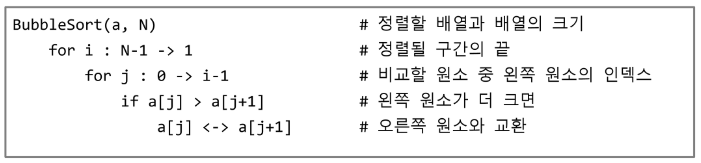
    </figure>
    - 구현예시<br>
    <figure>
    
    </figure>
### 4. 카운팅 정렬
- 카운팅 정렬
    - 항목들의 순서를 결정하기 위해 집합에 각 항목이 몇 개씩 있는지 세는 작업을 하여, 선형 시간에 정렬하는 **효율적인** 알고리즘
    - 제한 사항
        - 각 항목의 발생 회수를 기록하기 위해, 정소 항목으로 인덱스 되는 카운트들의 배열을 사용하기 때문에 **정수나 정수로 표형할 수 있는 자료에 대해서만 적용 가능**
        - 카운트들을 위한 충분한 공간을 할당하려면 집합 내의 가장 큰 정수를 알아야 한다.
    - 시간복잡도: O(n + k), (n: 리스트 길이, k: 정수의 최대값)<br><br>
- 카운팅 정렬 예시
    - 정렬 과정<br>
    <figure>
    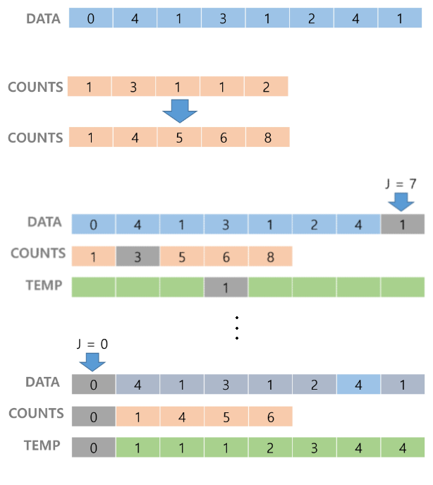
    </figure>
    - 구현 예시<br>
    <figure>
    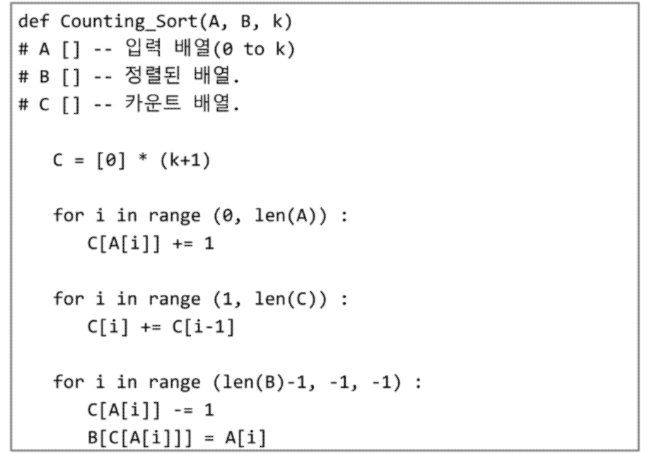
    </figure>
### 5. 완전검색
- 완전검색
    - 문제의 해법으로 생각할 수 있는 모둔 경우의 수를 나열해보고 확인하는 기법이다.
    - Brute-force 혹은 generate-and-test 기법이라고도 불린다.
    - 일반적으로 경우의 수가 상대적으로 작을 때 유용하다.
- 완전검색의 활용처
    - 모든 경우의 수를 생성하고 테스트하기 때문에 수행 속도는 느리지만, 해답을 찾아내지 못할 확률이 작다.
    - 자격검정평가 등에서 주어진 문제를 풀 때, **우선 완전검색으로 접근하여 해답을 도출한 후**, 성능 개선을 위해 다른 알고리즘을 사용하고 해답을 확인하는 것이 바람직하다.
- 완전검색 활용 예제: Baby-gin<br>
    <figure>
    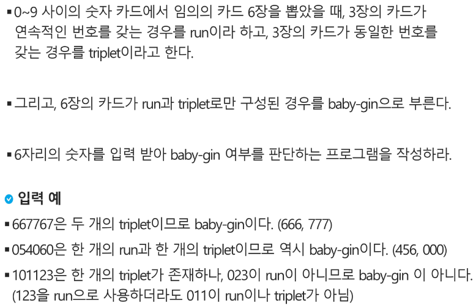
    </figure>
    1. 고려할 수 있는 모든 경우의 수 생성하기
        - 6개의 숫자로 만들 수 있는 모든 숫자 나열 (중복 포함)
    2. 해답 테스트 하기
        - 앞 뒤의 3자리를 잘라 run, triplet 여부를 테스트하고 최종적으로 baby-gin을 판단한다.
### 순열
- 순열
    - 서로 다른 것들 중 몇 개를 뽑아서 한 줄로 나열하는 것
    - 서로 다른 n개 중 r개를 택하는 순열은 아래와 같이 표현한다.
        ```
        nPr
        ```
    - 그리고 nPr은 다음과 같은 식이 성립한다.
        ```
        nPr = n * (n-1) * ... * (n-r+1)
        ```
    - nPn = n! 이라고 표기하며, Factorial이라 부른다.
        ```
        n! = n * (n-1) * ... * 2 * 1
        ```
- 단순하게 순열을 생성하는 방법.
    - 각 자리수별로 loop를 이용해 구현 가능<br>
        <figure>
        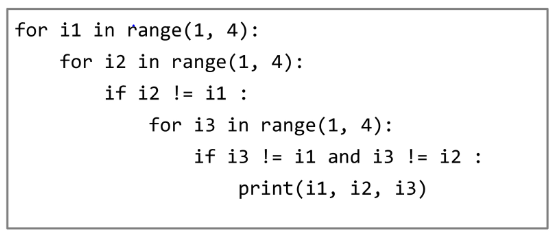
        </figure>
### 6. 그리디
- 탐욕 알고리즘
    - 탐욕 알고리즘은 최적해를 구하는 데 사용되는 근시안적인 방법
    - 여러 경우 중 하나를 결정해야 할 때마다 그 순간에 최적이라고 생각되는 것을 선택해 나가는 방식으로 진행하여 최종적인 해답에 도달한다.
    - 각 선택의 시점에서 이루어지는 결정은 지역적으로는 최적이지만, 그 선택들을 계속 수집하여 최정적인 해답을 만들었다고 하여, 그것이 최적이라는 보장은 없다
    - 일반적으로, 머릿속에 떠오르는 생각을 검증없이 바로 구현하면 그리디 접근이 된다.<br><br>
- 탐욕 알고리즘의 동작 과정
    1. 해 선택: 현재 상태에서 부분 문제의 최적 해를 구한 뒤, 이를 분석해 집합에 추가한다.
    2. 실행 가능성 검사: 새로운 부분해 집합이 실행 가능한지를 확인한다. 곧, 문제의 제약 조건을 위반하지 않는지 검사한다.
    3. 해 검사: 새로운부분해 집합이 문제의 해가 되는지를 확인한다. 아직 전체 문제의 해가 완성되지 않았다면 1.의 해 선택부터 다시 시작한다.
- 탐욕 알고리즘의 예: 거스름돈 줄이기<br>
    <figure>
    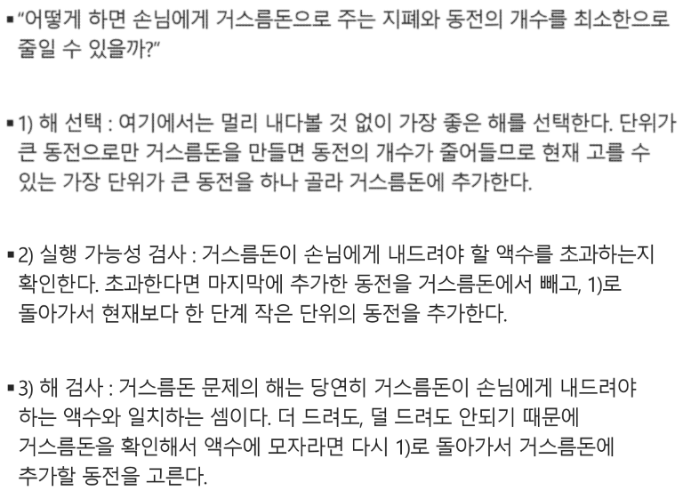
    </figure>
- 탐욕 알고리즘의 예: Baby-gin
    - counts 배열의 각 원소를 체크하여 run과 triplet, baby-gin 여부를 판단한다.<br>
    <figure>
    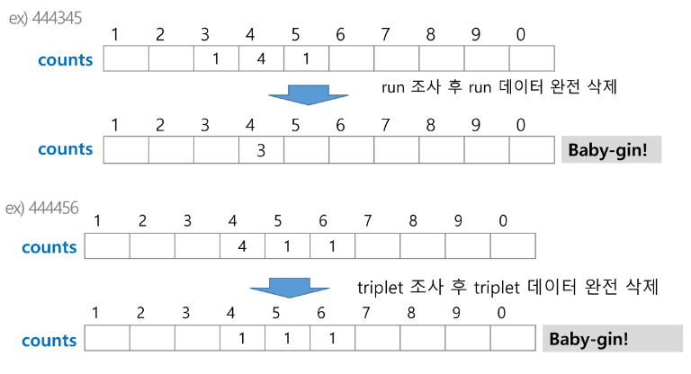
    </figure>
    - 구현 예시<br>
    <figure>
    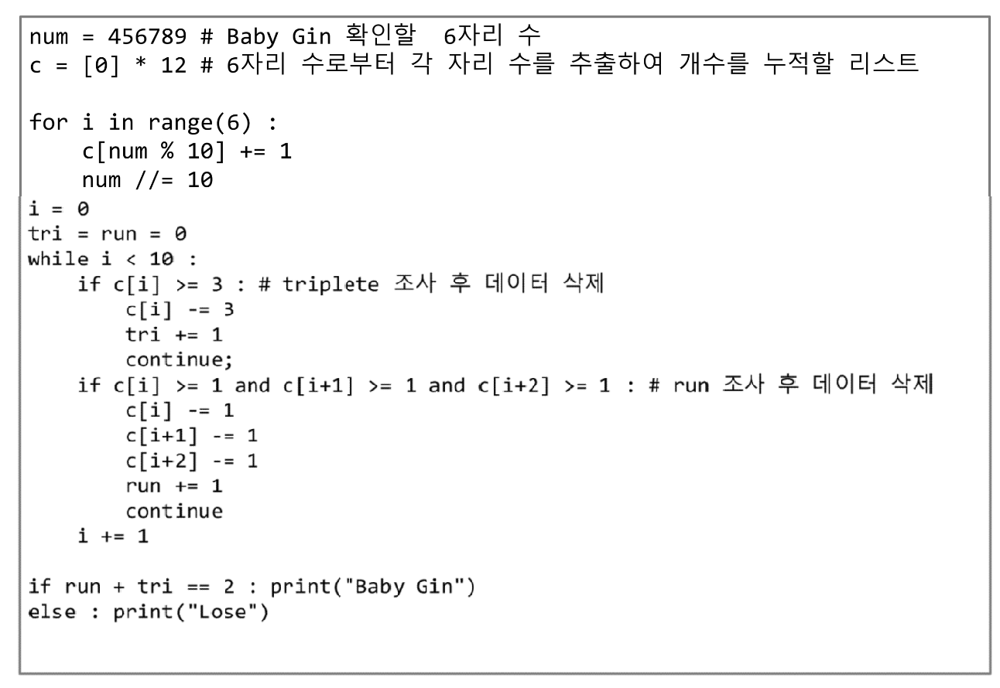
    </figure>
### 7. [배열: 2차원 배열](#목차)
- 2차원 배열
    - 선언
        - 1차원 List를 묶어놓은 List
        - 2차원 이상의 다차원 List는 차원에 따라 Index를 선언
        - 2차원 List의 선언: 세로길이(행의 개수), 가로길이(열의 개수)를 필요로 함
        - 파이썬에서는 데이터 초기화를 통해 변수선언과 초기화가 가능함
            ```
            arr = [[0, 1, 2, 3], 
                [4, 5, 6, 7]]
            
            # [참고]
            N = int(input())
            arr = [list(map(int, input().split())) for _ in range(N)]
            ```<br><br>
    - 접근
        - 배열 순회: n X m 배열의 n*m 개의 모든 원소를 빠짐없이 조사하는 방법
        - 행 우선 순회<br>
            <figure>
            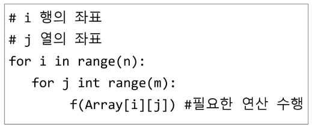
            </figure>
        - 열 우선 순회<br>
            <figure>
            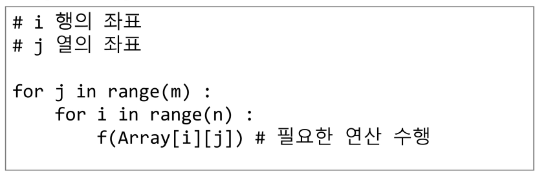
            </figure>
        - 지그재그 순회<br>
            <figure>
            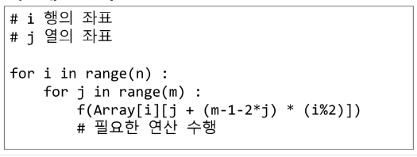
            </figure>
        - 델타를 이용한 2차 배열탐색<br>
            <figure>
            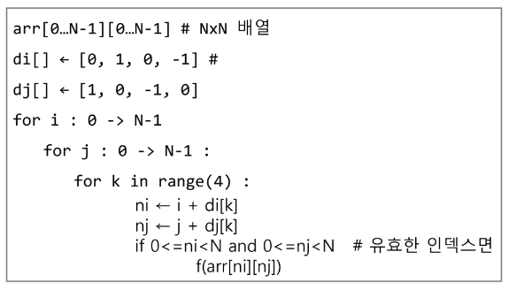
            </figure>
        - 전치 행렬<br>
            <figure>
            
            </figure>
### 8. [부분집합 생성](#목차)
- 부분집합 생성하기
    - 완전검색 기법으로 부분집합 합 문제를 풀기 위해서는, 우선 집합의 모든 부분 집합을 생성한 후에 각 부분집합의 합을 계산해야 한다.
    - 부분집합의 수:
        - 집합의 원소가 n개일 때, 공집합을 포함한 부분집합의 수는 2^n개 이다.
        - 이는 각 원소를 부분집합에 포함시키거나 포함시키지 않는 2가지 경우를 모든 원소에 적용한 경우의 수와 같다.<br>
        <figure>
        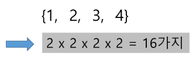
        </figure>
        - 루프를 이용하여 각원소의 포함여부를 확인하는 방법은 원소의 수가 많아지면 어렵다.
- 비트 연산자
    1. & : 비트 단위로 AND 연산을 한다.
    2. | : 비트 단위로 OR 연산을 한다.
    3. << : 피연산자의 비트 열을 왼쪽으로 이동시킨다.
    4. << : 피연산자의 비트 열을 오른쪽으로 이동시킨다.<br><br>
    - << 연산자
        - 1 << n : 2^n 즉, 원소가 n개일 경우 모든 부분집합의 수를 의미한다.
    - & 연산자
        - i & (1 << j) : i의 j번째 비트가 1인지 아닌지를 검사한다.<br><br>
    - 부분집합 구현<br>
    <figure>
    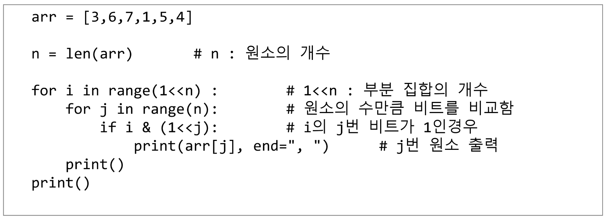
    </figure>
### 검색
- 저장되어 있는 자료 중에서 원하는 항목을 찾는 작업
- 목적하는 탐색 키를 가진 항목을 찾는 것
    - 탐색 키(search key): 자료를 구별하여 인식할 수 있는 키
- 검색의 종류
    - 순차 검색
    - 이진 검색
    - 해쉬
### 순차 검색
- 일렬로 되어 있는 자료를 순서대로 검색하는 방법
    - 가장 간단하고 직관적인 검색 방법
    - 배열이나 연결 리스트 등 순차구조로 구현된 자료구조에서 원하는 항목을 찾을 때 유용함
    - 알고리즘이 단순하여 구현이 쉽지만, 검색 대상의 수가 많은 경우에는 수행시간이 급격히 증가하여 비효율적임
- 정렬이 되어있지 않은 경우
    - 검색 과정
        1. 첫 번째 원소부터 순서대로 검색 대상과 키 값이 같은 원소가 있는지 비교하며 찾는다.
        2. 키 값이 동일한 원소를 찾으면 그 원소의 인덱스를 반환한다.
        3. 자료구조의 마지막에 이를 때까지 검색 대상을 찾지 못하면 검색 실패<br>
            <figure>
            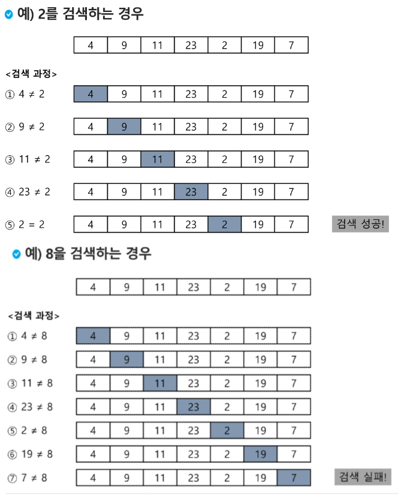
            </figure>
    - 찾고자 하는 원소의 순서에 따라 비교횟수가 결정됨
        - 첫 번째 원소를 찾을 때는 1번 비교, 두 번째 원소를 찾을 때는 2번 비교
        - 정렬되지 않은 자료에서의 순차 검색의 평균 비교 회수 = (n-1)/2
    - 구현 예시<br>
        <figure>
        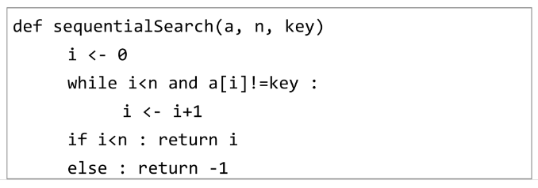
        </figure>
- 정렬되어 있는 경우
    - 검색 과정
        - 자료가 오름차순으로 정렬된 상태에서 검색을 실시한다고 가정하자.
        - 자료를 순차적으로 검색하면서 키 값을 비교하여, 원소의 키 값이 검색 대상의 키 값보다 크면 찾는 원소가 없다는 것이므로 더 이상 검색하지 않고 검색을 종료한다.<br>
    <figure>
    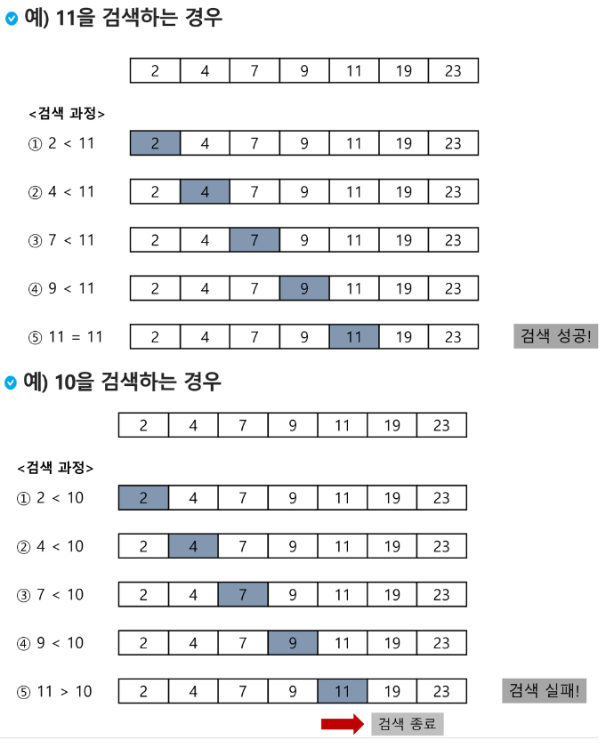
    </figure>
    - 찾고자 하는 원소의 순서에 따라 비교 횟수가 결정됨
        - 정렬이 되어있으므로, 검색 실패를 반환하는 경우 평균 비교 회수가 반으로 줄어든다.
        - 시간복잡도: O(n)<br>
        <figure>
        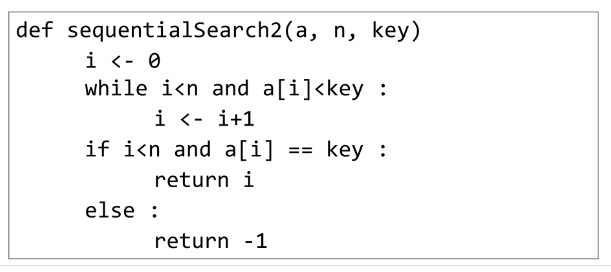
        </figure>
### 9. [이분탐색](#목차)
- 이진 검색
    - 자료의 가운데에 있는 항목의 키 값과 비교하여 다음 검색의 위치를 결정하고 검색을 계속 진행하는 방법
        - 목적 키를 찾을 때까지 이진 검색을 순환적으로 반복 수행함으로써 검색 범위를 반으로 줄여가면서 보다 빠르게 검색을 수행함
    - 이진 검색을 하기 위해서는 자료가 정렬된 상태여야 한다.
- 검색 과정
    1. 자료의 중앙에 있는 원소를 고른다.
    2. 중앙 원소의 값과 찾고자 하는 목표 값을 비교한다.
    3. 목표 값이 중앙 원소의 값보다 작으면 자료의 왼쪽 반에 대해서 새로 검색을 수행하고, 크다면 자료의 오른쪽 반에 대해서 새로 검색을 수행한다.
    4. 찾고자 하는 값을 찾을 때까지 1~3의 과정을 반복한다.<br>
        <figure>
        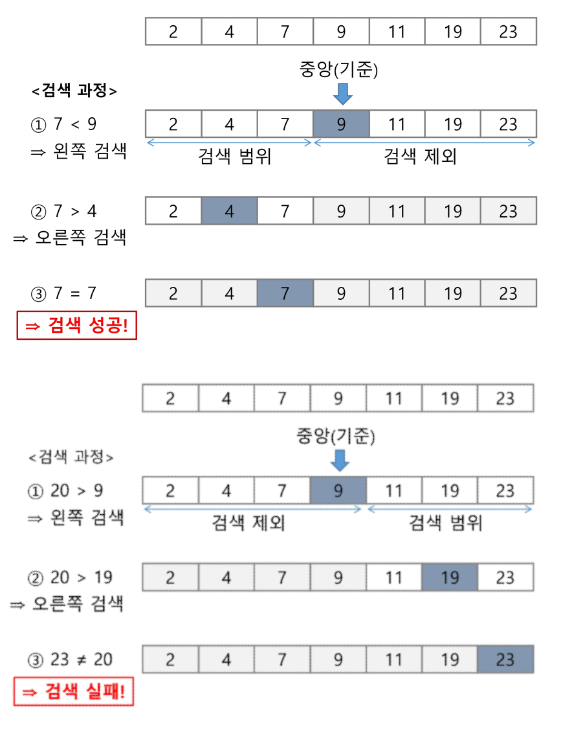
        </figure>
- 구현 예시
    - while문 활용<br>
        <figure>
        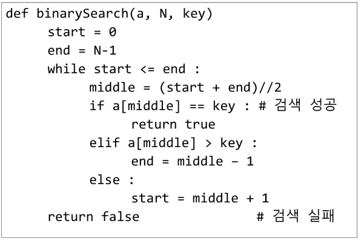
        </figure>
    - 재귀함수 활용<br>
        <figure>
        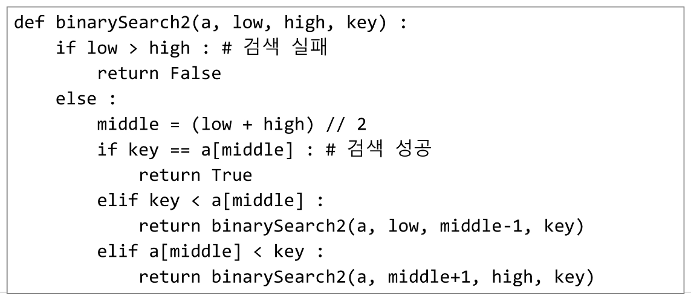
        </figure>
### 인덱스
- 인덱스라는 용어는 데이터베이스에서 유래했으며, 테이블에 대한 독작 속도를 높여주는 자료 구조를 일컫는다. 데이터베이스 분야가 아닌 고셍서는 Look up table 등의 용어를 사용하기도 한다.
- 인덱스를 저장하는데 필요한 디스크 공간은 보통 테이블을 저장하는데 필요한 디스크 공간보다 작다. 왜냐하면 보통 인덱스는 키-필드만 갖고 있고, 테이블의 다른세부 항목들은 갖고 있지 않기 때문이다.<br><br>
- 배열을 사용한 인덱스
    - 대량의 데이터를 매번 정렬하면, 프로그램의 반응은 느려질 수 밖에 없다. 이러한 대량 데이터의 성능 저하 문제를 해결하기 위해 배열 인덱스를 사용할 수 있다.<br><br>
- 다음 예에서 원본 데이터 배열과 별개로, 배열 인덱스를 추가한 예를 보여 주고 있다.
    - 원본 데이터에 데이터가 삽일될 경우 상대적으로 크기가 작은 인덱스 배열을 정렬하기 때문에 속도가 빠르다.<br>
    <figure>
    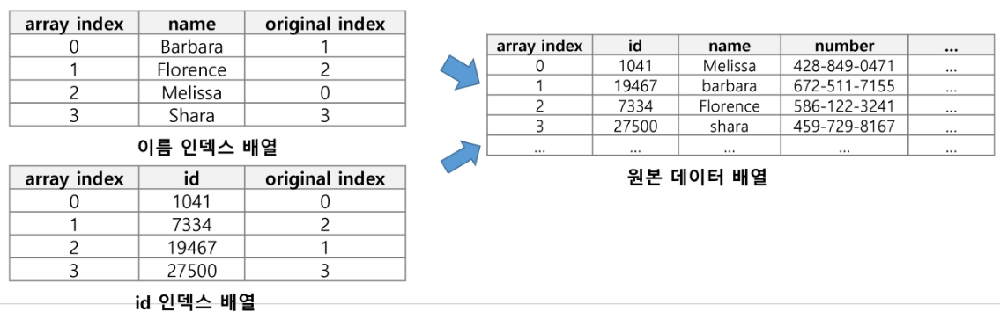
    </figure>
### 10. [셀렉션 알고리즘](#목차)
- 저장되어 있는 자료로부터 k번째로 큰 혹은 작은 원소를 찾는 방법
    - 최소값, 최대값 혹은 중간값을 찾는 알고리즘을 의미하기도 한다.<br><br>
- 선택 과정
    1. 정렬 알고리즘을 이용하여 자료 정렬하기
    2. 원하는 순서에 있는 원소 가져오기
- 구현 예시<br>
    <figure>
    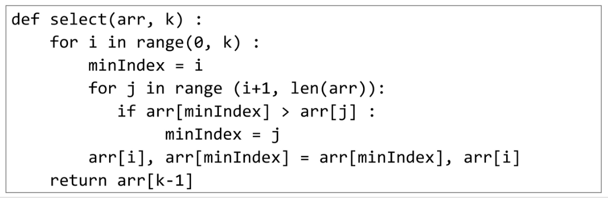
    </figure>
### 11. [선택정렬](#목차)
- 주어진 자료들 중 가장 작은 값의 원소부터 차례대로 선택하여 위치를 교환하는 방식
    - 셀렉션 알고리즘을 전체 자료에 적용한 것이다.<br><br>
- 정렬 과정
    1. 주어진 리스트 중에서 최소값을 찾는다.
    2. 그 값을 리스트의 맨 앞에 위치한 값과 교환한다.
    3. 맨 처음 위치를 제외한 나머지 리스트를 대상으로 위의 과정을 반복한다.
- 시간복잡도 : O(n^2)<br>
    <figure>
    
    </figure>
- 슈도 코드<br>
    <figure>
    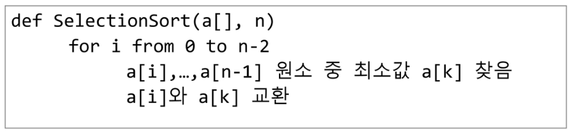
    </figure>
- 구현 예시<br>
    <figure>
    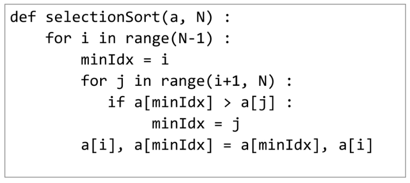
    </figure>