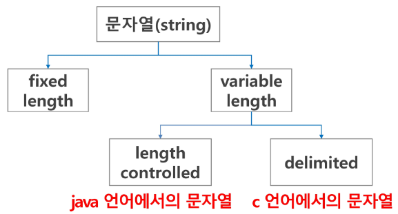
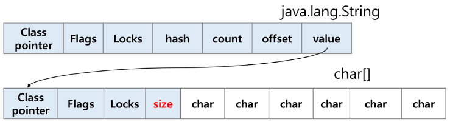
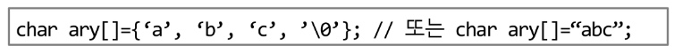
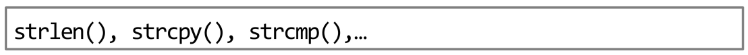
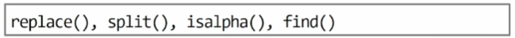

## 목차

1. 문자열
2. 패턴매칭
3. 문자열 암호화
4. 문자열 압축

### 문자의 표현
- 컴퓨터에서의 문자표현
    - 글자 A를 메모리에 저장하는 방법
        - 메모리는 숫자만을 저장할 수 있다.
        - A라는 글자의 모양 그대로 비트맵으로 저장하는 방법은 메모리 낭비가 심하다.
        - 따라서 각 문자에 대해 대응되는 숫자를 정해놓고 이것을 메모리에 저장하는 방법이 사용된다.
    - 코드체계
        - 영어는 대소문자 합이 52개이므로 6비트로 모두 표현이 가능
        - 000000 == 'a', 000001 == 'b'
- ASCII 문자 인코딩 표준
    - 초기에는 지역별 코드체계를 사용하였으나, 서로간 정보 전달이 어려워 표준안을 만들었음
    - 7비트 인코딩으로 128개의 문자를 표현하며, 33개의 제어문자와 95개의 출력 가능 문자로 이루어져 있다.
    - 65: A, 97: a, 0: 48, etc...
- 확장 ASCII
    - 특수문자, 악센트 문자 등 부가적인 문자를 128개 추가
    - 각 나라마다 재정의하여 사용함
    - 완성형과 조합형이 있다.
- 유니코드
    - 각국의 코드체계를 처리하기 위해 마련한 표준
    - 세부 분류로 Character Set이 있다.
    - 유니코드를 저장하는 변수의 크기를 정의, 바이트 순서에 대한 표준화도 필요(유니코드 외부 인코딩)
- Python 인코딩
    - 2.x 버전: #-\*-coding: utf-8-\*-
    - 3.x 버전: 생략가능
    - 이외의 방식이 필요하다면 첫 줄에 방식을 지정
## 1. 문자열
### 1-1. 문자열의 분류<br>
<figure>

</figure>

### 1-2. 각 언어에서 문자열 클래스에 대한 메모리 배치<br>
  - 자바, 파이썬: 연관 정보를 별도로 저장함<br>
      <figure>
      
      </figure>
  - C 언어: 문자열 자체를 저장, 널문자(\0)를 통해 문자열 끝을 표시, 연관된 명령어를 제공
      <figure>
      
      
      </figure>
- 참고
    - 다음 두 코드의 차이
        ```python
        s1 = list(input())  # ['a', 'b', 'c']
        s2 = input()  # abc
        ```
    - strlen() 함수 만들어 보기
        - \0을 만나면 \0을 제외한 글자수를 리턴
        - while을 사용
            ```python
            def strlen(a):
                i = 0
                while a[i] != '\0':
                    i += 1
                return i
            ```
### 1-3. 문자열 처리
- Java에서의 문자열 처리
    1. 문자열 데이터를 저장, 처리해주는 클래스를 제공한다.
    2. String 클래스를 사용한다.
    3. 문자열 처리에 필요한 연산을 연산자, 메서드 형태로 제공한다.<br><br>
- Python에서의 문자열 처리
    1. char 타입이 없다.
    2. 텍스트 데이터의 취급 방법이 통일되어 있다.
       1. 문자열 기호: 
            - ' (작은 따옴표)
            - " (큰 따옴표)
            - ''' (여러 문자열, 작은 따옴표 3개)
            - """ (여러 문자열, 큰 따옴표 3개)
       2. 문자열 연산: 
            - \+ : 연결
            - \* : 반복
    3. 문자열은 시퀀스 자료형으로 분류되고, 시퀀스 자료형에서 사용할 수 있는 인덱싱, 슬라이싱 연산들을 사용할 수 있음
       - 제공되는 메서드<br>
           <figure>
           
           </figure>
    4. 문자열의 요소는 변경할 수 없음(immutable)<br><br>
- C와 자바의 문자열 처리 차이점
    1. C는 아스키 코드로 저장(한글의 길이를 재면 2씩 나옴)
    2. 자바(UTF16), 파이썬(UTF8)은 유니코드로 저장
### 1-4. 문자열 뒤집기

