## 목차

1. [문자열](#1-문자열)
2. [패턴매칭](#2-패턴-매칭)
3. [문자열 암호화](#3-문자열-암호화)
4. [문자열 압축](#4-문자열-압축)

### 문자의 표현
- 컴퓨터에서의 문자표현
    - 글자 A를 메모리에 저장하는 방법
        - 메모리는 숫자만을 저장할 수 있다.
        - A라는 글자의 모양 그대로 비트맵으로 저장하는 방법은 메모리 낭비가 심하다.
        - 따라서 각 문자에 대해 대응되는 숫자를 정해놓고 이것을 메모리에 저장하는 방법이 사용된다.
    - 코드체계
        - 영어는 대소문자 합이 52개이므로 6비트로 모두 표현이 가능
        - 000000 == 'a', 000001 == 'b'
- ASCII 문자 인코딩 표준
    - 초기에는 지역별 코드체계를 사용하였으나, 서로간 정보 전달이 어려워 표준안을 만들었음
    - 7비트 인코딩으로 128개의 문자를 표현하며, 33개의 제어문자와 95개의 출력 가능 문자로 이루어져 있다.
    - 65: A, 97: a, 0: 48, etc...
- 확장 ASCII
    - 특수문자, 악센트 문자 등 부가적인 문자를 128개 추가
    - 각 나라마다 재정의하여 사용함
    - 완성형과 조합형이 있다.
- 유니코드
    - 각국의 코드체계를 처리하기 위해 마련한 표준
    - 세부 분류로 Character Set이 있다.
    - 유니코드를 저장하는 변수의 크기를 정의, 바이트 순서에 대한 표준화도 필요(유니코드 외부 인코딩)
- Python 인코딩
    - 2.x 버전: #-\*-coding: utf-8-\*-
    - 3.x 버전: 생략가능
    - 이외의 방식이 필요하다면 첫 줄에 방식을 지정
## 1. [문자열](#목차)
### 1-1. 문자열의 분류<br>
<figure>
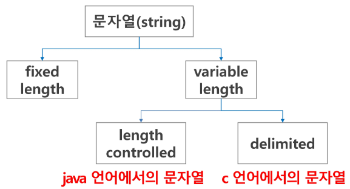
</figure>

### 1-2. 각 언어에서 문자열 클래스에 대한 메모리 배치<br>
  - 자바, 파이썬: 연관 정보를 별도로 저장함<br>
      <figure>
      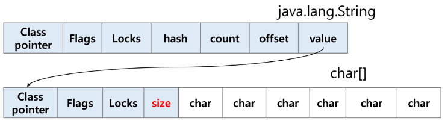
      </figure>
  - C 언어: 문자열 자체를 저장, 널문자(\0)를 통해 문자열 끝을 표시, 연관된 명령어를 제공
      <figure>
      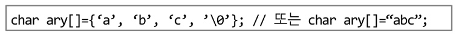
      
      </figure>
- 참고
    - 다음 두 코드의 차이
        ```python
        s1 = list(input())  # ['a', 'b', 'c']
        s2 = input()  # abc
        ```
    - strlen() 함수 만들어 보기
        - \0을 만나면 \0을 제외한 글자수를 리턴
        - while을 사용
            ```python
            def strlen(a):
                i = 0
                while a[i] != '\0':
                    i += 1
                return i
            ```
### 1-3. 문자열 처리
- Java에서의 문자열 처리
    1. 문자열 데이터를 저장, 처리해주는 클래스를 제공한다.
    2. String 클래스를 사용한다.
    3. 문자열 처리에 필요한 연산을 연산자, 메서드 형태로 제공한다.<br><br>
- Python에서의 문자열 처리
    1. char 타입이 없다.
    2. 텍스트 데이터의 취급 방법이 통일되어 있다.
       1. 문자열 기호: 
            - ' (작은 따옴표)
            - " (큰 따옴표)
            - ''' (여러 문자열, 작은 따옴표 3개)
            - """ (여러 문자열, 큰 따옴표 3개)
       2. 문자열 연산: 
            - \+ : 연결
            - \* : 반복
    3. 문자열은 시퀀스 자료형으로 분류되고, 시퀀스 자료형에서 사용할 수 있는 인덱싱, 슬라이싱 연산들을 사용할 수 있음
       - 제공되는 메서드<br>
           <figure>
           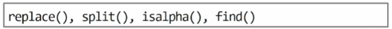
           </figure>
    4. 문자열의 요소는 변경할 수 없음(immutable)<br><br>
- C와 자바의 문자열 처리 차이점
    1. C는 아스키 코드로 저장(한글의 길이를 재면 2씩 나옴)
    2. 자바(UTF16), 파이썬(UTF8)은 유니코드로 저장

---
###  문자열 뒤집기
- 2가지 방법
    1. 자기 문자열에서 뒤집는 방법
        - swap 을 위한 임시 변수가 필요
        - 문자열 길이의 반만큼 반복<br>
            <figure>
            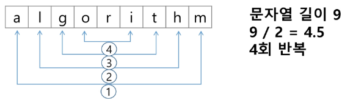
            </figure>
    2. 새로운 문자열을 만들어 소스의 뒤에서부터 읽어서 타겟에 쓰는 방법
- 파이썬 문자열 뒤집기 구현
```python
s = 'reverse'

# 방법 1
s = s[::-1]

# 방법 2
s = list(s)
s.reverse()
s = ''.join(s)

# 방법 3
s = list(s)
N = len(s)
for i in range(N//2):
    s[i], s[-i-1] = s[-i-1], s[i]
s = ''.join(s)
```
<br><br>

### 문자열 비교
- C 언어 : strcmp() (문자열 비교)
    ```c
    int my_strcmp(const char *str1, const char *str2)
    {
        int i = 0;
        while(str1[i] != '\0')
        {
            if(str1[i] != str2[i] break);
            i++;
        }
        return (str1[i] - str2[i]);
    }
    ```
- Java : equals() (문자열 비교), == (메모리 참조 비교)
- Python : == (문자열 비교), is (메모리 참조(?) 비교)
    - (참고) ==는 내부 메서드 \_\_eq\_\_()를 호출
    - (추가 설명) 처음부터 같은 문자열은 같은 메모리를 참고하지만, 슬라이싱 등 조작된 문자열은 다른 메모리를 참고하도록 되어있다.
    ```python
    s1 = 'abc'
    s2 = 'abc'
    s3 = s1[:2] + 'c'

    s1 == s2 # True
    s1 is s2 # True
    s1 == s3 # True
    s1 is s3 # False
    ```
<br><br>

### 문자열 정수 변환
- C 언어 : atoi(), 역함수-itoa()
- Java : parse 메소드 ( Integer.parseInt(String) ), 역함수-toString()
- 파이썬 : 숫자, 문자 변환 함수 ( int(), float() ), 역함수-str(), repr()
    ```python
    def atoi(s):
        i = 0
        for x in s:
            i = i*10 + ord(x) - ord('0')
        return i
    def itoa(i):
        s = ''
        while a > 0:
            s += chr(ord('0') + a % 10)
            a //= 10
        return s[::-1]
    ```
<br><br>

## 2. [패턴 매칭](#목차)
### 2-1. 고지식한 알고리즘(Brute Force)
- 아이디어
    - 본문 문자열을 처음부터 끝까지 차례대로 순회하면서 패턴 내의 문자들을 일일이 비교하는 방식<br>
    <figure>
    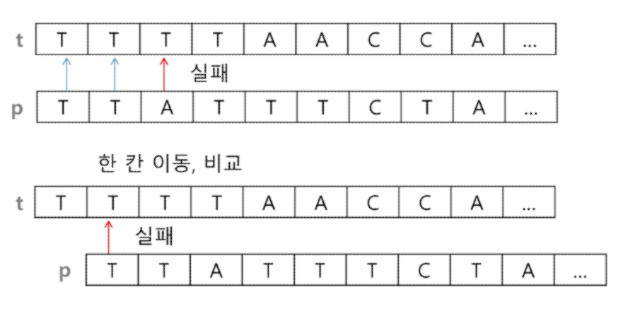
    </figure>
- 슈도코드<br>
    <figure>
    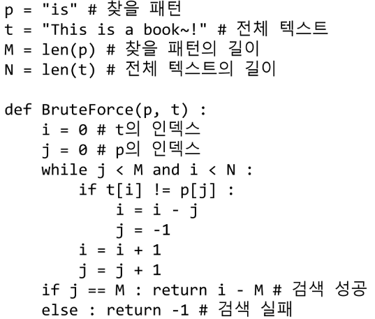
    </figure>
- 시간복잡도 : O(MN) (최악의 경우)
### 2-2. KMP 알고리즘
- 아이디어
    - 불일치가 발생한 텍스트 스티링의 앞 부분에 어떤 문자가 있는지를 미리 알고 있으므로, 불일치가 발생한 앞 부분에 대하여 다시 비교하지 않고 매칭을 수행
    - 패턴을 전처리하여 배열 next[M]을 구해서 잘못된 시작을 최소화함
        - next[M] : 불일치가 발생했을 경우 이동할 다음 위치<br>
    <figure>
    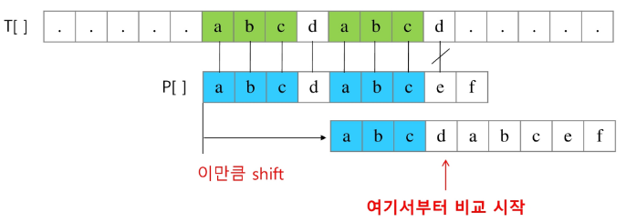
    </figure>
    - 매칭이 실패했을 때 돌아갈 곳을 계산하기<br>
    <figure>
    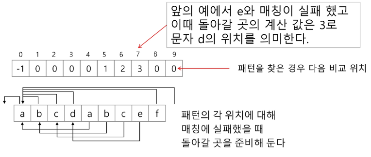
    </figure>
- 시간복잡도 : O(M+N)
### 2-3. 보이어-무어 알고리즘
- 특징
    - 오른쪽에서 왼쪽으로 비교
    - 대부분의 상용 소프트웨어에서 채택하고 있는 알고리즘
    - 시간복잡도 : Ω(n) (최선의 경우), Θ(mn) (최악의 경우)
- 아이디어
    - 패턴에 오른쪽 끝에 있는 문자가 불일치 하고, 이 문자가 패턴 내에 존재하지 않는 경우
        - 이동거리는 패턴의 길이만큼이 된다.<br>
        <figure>
        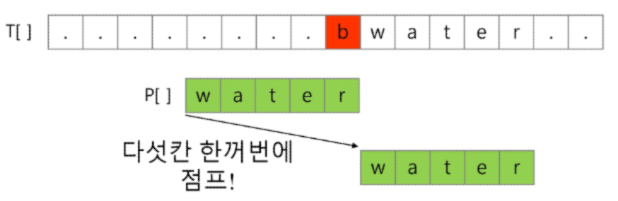
        </figure>
    - 오른쪽 끝에 있는 문자가 불일치 하고, 이 문자가 패턴 내에 존재할 경우<br>
        <figure>
        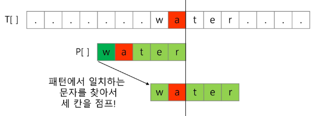
        </figure>
- 예시<br>
    <figure>
    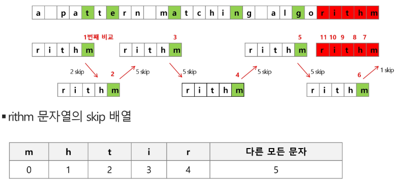
    </figure>
### 문자열 매칭 알고리즘 비교
- 문자열 패턴의 길이: M, 총 문자열 길이: N
1. Brute Force : O(MN)
2. Rabin-Karp : Θ(n)
3. KMP : Θ(n)
4. Boyer-Moore : Ω(n) (최선의 경우), Θ(mn) (최악의 경우)
## 3. [문자열 암호화](#목차)
### 시저암호
- 기원전 100년경 로마의 장군인 줄리어스 시저가 사용한 암호로, 평문에서 사용되고 있는 알파벳을 일정한 문자수만큼 '평행이동' 시킴으로써 암호화를 했다.
### 문자 변환표를 이용한 함호화(단일 치환 암호)
- 단순 카이사르 암호화보다 강력한 암호화 기법
- 각 문자마다 매칭되는 문자를 지정한 변환표를 이용하여 암호화
- 단일 치환 암호 총 키의 수는 26! 이다.
### bit열의 암호화
- 배타적 논리합 연산(^, XOR) 사용
## 4. [문자열 압축](#목차)
### Run-length encoding 알고리즘
- 같은 값이 몇 번 반복되는가를 나타내어 압축
- BMP 파일 포맷의 압축 방법
### 허프만 코딩 알고리즘
- 자주 사용된 문자를 비트단위로 치환하여 압축
