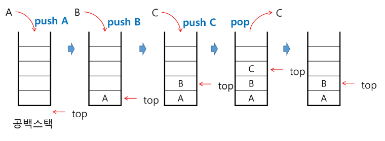

## 목차

1. 스택
2. 재귀호출
3. Memoization
4. DP
5. DFS
6. 계산기1
7. 계산기2
8. 백트래킹
9. 부분집합, 순열
10. 분할정복

## 1. [스택](#목차)

### 1-1. 스택의 특성

1. 선형 구조
   - 자료 간의 관계가 1대 1의 관계를 갖는다.
   - 비선형구조는 1대 N의 관계 (ex. 트리)
2. 후입선출(LIFO)
   - 자료를 삽입하거나 꺼낼 수 있다.
   - 나중에 삽입한 자료부터 꺼낼 수 있다.

### 1-2. 스택의 구현

- 자료구조
  - 자료를 선형으로 저장할 저장소
  - 배열을 사용할 수 있다.
  - 마지막에 삽입된 원소의 위치를 top 이라 한다.
  - 저장소 자체를 스택이라 부르기도 함
- 연산<br>
        <figure>
        
        </figure>
    - 삽입 : 저장소에 자료를 저장. push
        ```python
        size = 10
        stack = [0] * size
        top = -1
        # 구현 1
        top += 1
        stack[top] = 20

        # 구현 2
        def push(item, size):
            global top
            top += 1
            if top == size:
                return
            else:
                stack[top] = item

        push(10, size)
        ```
    - 삭제 : 저장소에서 자료를 꺼냄. pop
        ```python
        # 구현 1, 내장함수 활용
        def pop():
            if len(s) == 0:
                return
            else:
                return s.pop()

        # 구현 2, index 활용
        def pop():
            global top
            if top == -1:
                return
            else:
                top -= 1
                return stack[top+1]
        ```
    - 공백여부 : 스택이 공백인지 확인. isEmpty
    - top 반환 : 스택의 top 원소를 확인. peek
- 고려사항
    - 1차원 배열을 사용하여 구현할 경우 구현이 용이하지만, 크기 변경이 어렵다.
    - 다른 방식으로, 동적 연결리스트를 이용하여 저장소를 동적으로 할당하는 방식이 있다.