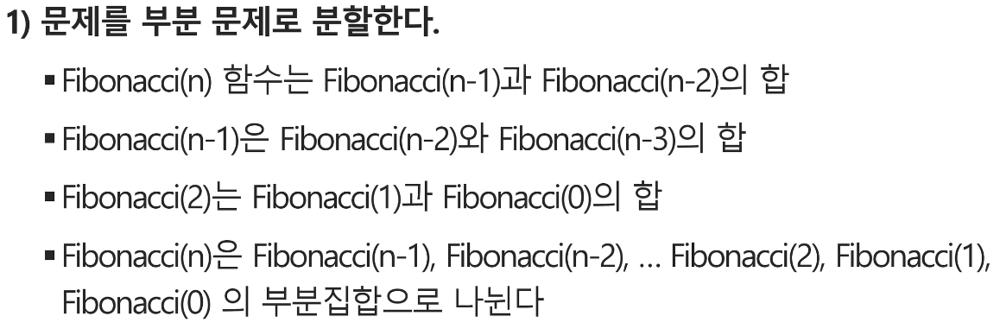

## 목차

1. [스택](#1-스택)
2. [재귀호출](#2-재귀호출)
3. [Memoization](#3-memoization)
4. [DP](#4-dp)
5. DFS
6. 계산기1
7. 계산기2
8. 백트래킹
9. 부분집합, 순열
10. 분할정복

## 1. [스택](#목차)

### 1-1. 스택의 특성

1. 선형 구조
   - 자료 간의 관계가 1대 1의 관계를 갖는다.
   - 비선형구조는 1대 N의 관계 (ex. 트리)
2. 후입선출(LIFO)
   - 자료를 삽입하거나 꺼낼 수 있다.
   - 나중에 삽입한 자료부터 꺼낼 수 있다.

### 1-2. 스택의 구현

- 자료구조
  - 자료를 선형으로 저장할 저장소
  - 배열을 사용할 수 있다.
  - 마지막에 삽입된 원소의 위치를 top 이라 한다.
  - 저장소 자체를 스택이라 부르기도 함
- 연산<br>
        <figure>
        
        </figure>
    - 삽입 : 저장소에 자료를 저장. push
        ```python
        size = 10
        stack = [0] * size
        top = -1
        # 구현 1
        top += 1
        stack[top] = 20

        # 구현 2
        def push(item, size):
            global top
            top += 1
            if top == size:
                return
            else:
                stack[top] = item

        push(10, size)
        ```
    - 삭제 : 저장소에서 자료를 꺼냄. pop
        ```python
        # 구현 1, 내장함수 활용
        def pop():
            if len(stack) == 0:
                return
            else:
                return s.pop()

        # 구현 2, index 활용
        def pop():
            global top
            if top == -1:
                return
            else:
                top -= 1
                return stack[top+1]
        ```
    - 공백여부 : 스택이 공백인지 확인. isEmpty
        ```python
        def isEmpty():
            global top
            if top == -1:
                return True
            else:
                return False
        ```
    - top 반환 : 스택의 top 원소를 확인. peek
        ```python
        def top()
            global top
            return stack[top]
        ```
- 고려사항
    - 1차원 배열을 사용하여 구현할 경우 구현이 용이하지만, 크기 변경이 어렵다.
    - 다른 방식으로, 동적 연결리스트를 이용하여 저장소를 동적으로 할당하는 방식이 있다.

### 1-3. 스택의 응용

#### 1. 괄호검사

- 조건<br>
        <figure>
        
        </figure>
    1. 왼쪽 괄호의 개수와 오른쪽 괄호의 개수가 같아야 한다.
    2. 같은 괄호에서 왼쪽 괄호는 오른쪽 괄호보다 먼저 나와야 한다.
    3. 괄호 사이에는 포함 관계만 존재한다.

#### 2. function call


## 2. [재귀호출](#목차)

- 재귀호출 : 자기 자신을 호출하여 순환 수행되는 것
- 재귀호출 방식을 사용하면 프로그램의 크기를 줄이고 간단하세 작성할 수 있다.
- 예시1. Factorial<br>
    <figure>
    <br>
    
    </figure>
- 예시2. Fibonachi<br>
    ```python
    F_0 = 0, F_1 = 1
    F_i = F_i-1 + F_i-2 for i >= 2
    ```
    <figure>
    
    </figure>

## 3. [Memoization](#목차)

- 재귀를 이용한 방법의 단점 중 하나는 중복호출이 존재할 수 있다는 점이다.<br>
    <figure>
    
    </figure>
- 이를 해결하기 위해 이전에 계산한 값을 저장할 필요가 있다.

### 3-1. Memoization
- 메모이제이션: 
    - 컴퓨터 프로그램을 실행할 때 이전에 계산한  값을 메모리에 저장해서 매번 다시 계산하지 않도록 하여 전체적인 실행속도를 빠르게 하는 기술.
    - 동적 계획법(Dynamic programing)의 핵심이 되는 기술이다.<br>
        <figure>
        
        </figure>
    - 피보나치 수열의 경우 시간복잡도 = Θ(n)

## 4. [DP](#목차)

- 동적 계획 알고리즘:
    - 최적화 문제를 해결하는 알고리즘 (그리디 알고리즘과 유사)
    - 입력 크기가 작은 부분 문제들을 모두 해결한 후에 그 해들을 이용하여 보다 큰 크기의 부분 문제들을 해결하여, 최종적으로 원래 주어진 입력의 문제를 해결하는 알고리즘
- 동적 계획법의 순서
    1. 문제를 부분 문제로 분할한다.
    2. 가장 작은 부분 문제부터 해를 구한다.
    3. 결과를 테이블에 저장하고, 테이블에 저장된 부분 문제의 해를 이용하여 상위 문제의 해를 구한다.
- DP 구현 방식
    1. recursive
    2. iterative
    - 재귀적 구조는 내부에 시스템 호출 스택을 사용하는 오버해드가 발생하기 때문에 memoization을 재귀적 구조에 사용하는 것 보다 반복적 구조로 구현한 것이 효율적이다.
- 예시1. Fibonachi<br>
    <figure>
    <br>
    <br>
    
    </figure>

## 5. DFS

- 비선형구조인 그래프 구조는 그래프로 표현된 모든 자료를 빠짐없이 검색하는 것이 중요하다.
- 이 때, 사용하는 두 가지 방법은 다음이 있다.
    1. 깊이 우선 탐색(Depth First Search, DFS)
    2. 너비 우선 탐색(Breadth First Search, BFS)

### 5-1. DFS
- 깊이 우선 탐색:
    - 시작 정점의 한 방향으로 갈 수 있는 경로가 있는 곳까지 깊이 탐색해 가다가 더 이상 갈 곳이 없게 되면, 가장 마지막에 만났던 갈림길 간선이 있는 정점으로 되돌아와서 다른방향의 정점으로 탐색을 계속 반복하여 결국 모든 정점을 방문하는 순회방법
    - 가장 마지막에 만났던 갈림길의 정점으로 되돌아가야 하므로 후입 선출 구조의 **스택**을 사용한다.
- 구현 순서
    1. 초기 상태 설정 : 배열 visited를 Flase로 초기화하고, 공백 스택을 생성한다.<br>
        <figure>
        
        </figure>
    2. 시작 정점 v를 결정하여 방문한다.<br>
        <figure>
        
        </figure>
    3. 정점 v에 인접한 정점중에서
        1. 방문하지 않은 정점 w가 있으면, 정점 v를 스택에 push하고 정점 w를 방문한다. 그리고 w를 v로 하여다시 2.를 반복한다.<br>
            <figure>
            
            </figure>
        2. 방문하지 않은 정점이 없으면, 탐색의 방향을 바꾸기 위해서 스택을 pop하여 받은 가장 마지막 방문 정점을 v로 하여 다시 2.를 반복한다.<br>
            <figure>
            <br>
            
            </figure>
    4. 스택이 공백이 될 때까지 2.를 반복한다.<br>
        <figure>
        
        </figure>
- 슈도 코드<br>
    <figure>
    
    </figure>
    