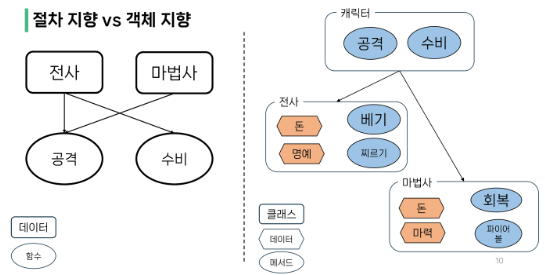

## 목차

# 클래스
## 1. 객체지향 프로그래밍
### 1-1. 개요
#### 절차 지향 프로그래밍(Procedural Programming)
- 프로그램을 **'데이터'와 '절차'**로 구성하는 방식의 프로그래밍 **패러다임**
  
 

---
- 절차 지향 프로그래밍 특징
  - "데이터"와 해당 데이터를 처리하는 "함수(절차)"가 분리되어 있으며, 함수 호출의 **흐름**이 중요 
  - 코드의 순차적인 흐름과 함수 호출에 의해 프로그램이 진행
    - 실제로 실행되는 내용이 무엇이 무엇인가가 중요
    - 데이터를 다시 재사용하거나 하기보다는 처음부터 끝까지 실행되는 결과물이 중요한 방식
- 소프트웨어 위기
  - 하드웨어의 발전으로 컴퓨터 계산용량과 문제의 복잡성이 급격히 증가함에 따라 소프트웨어에 발생한 충격

 

#### 객체 지향 프로그래밍(Object Oriented Programming)
- 데이터와 해당 데이터를 조작하는 **메서드**를 **하나의 객체**로 묶어 관리하는 방식의 프로그래밍 패러다임

 

- 절차 지향 vs 객체 지향

 
